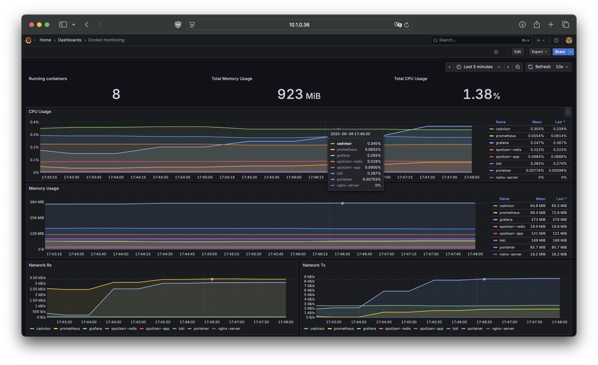
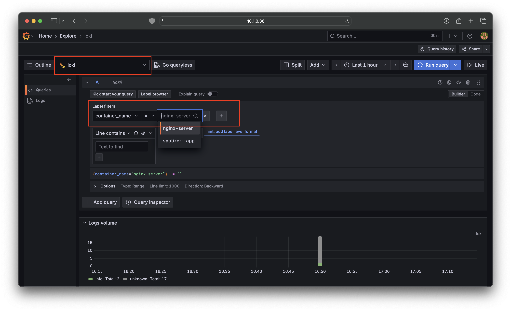
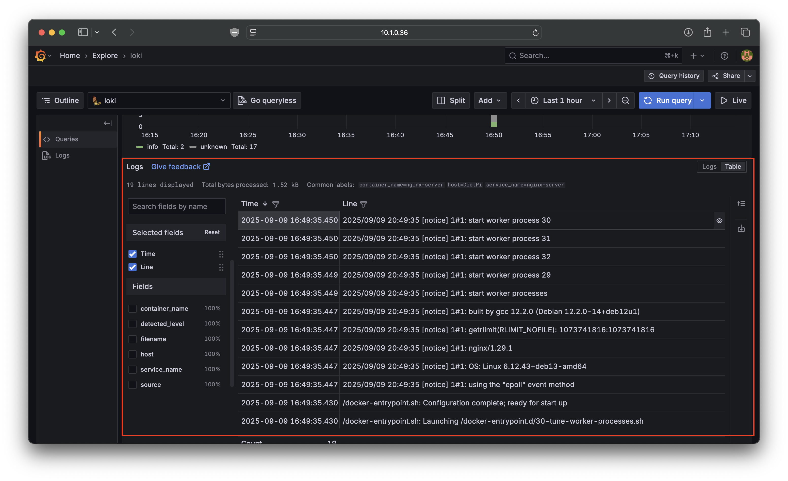
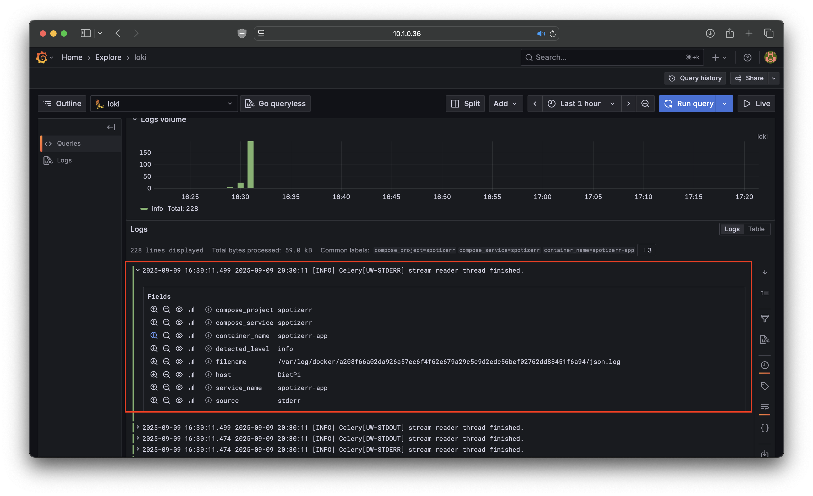
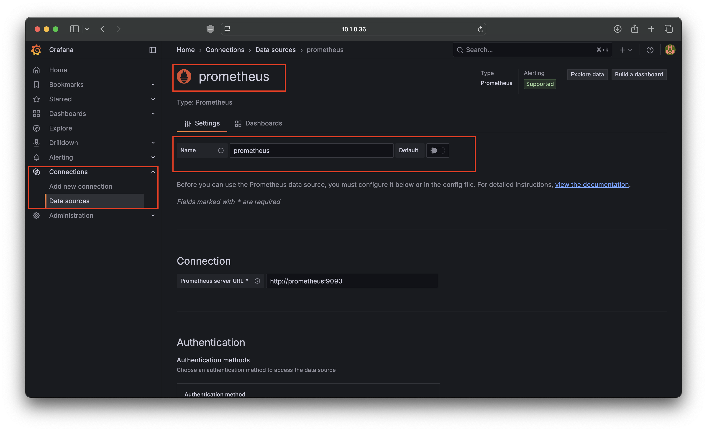
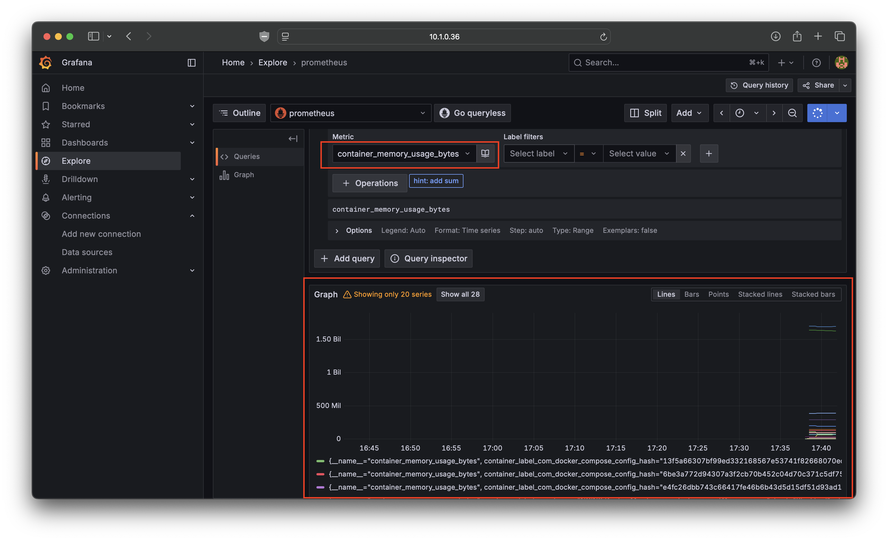

# Monitoring Stack (Grafana + Prometheus + cAdvisor + Loki)

An integrated monitoring stack with Grafana, Prometheus, Loki, and cAdvisor for centralized monitoring of multiple Docker hosts. Prometheus collects time-series metrics, cAdvisor provides detailed container insights, Loki aggregates logs, and Grafana visualizes the data for real-time status monitoring and troubleshooting across your infrastructure

Although options like Portainer, Podman provide monitoring, its nice to have a dashboard built from ground up and tailored to your requirements, this stack solves that

---

## Pictures
<p align="center"><i>The result Grafana Dashboard</i></p>
<p align="center">
  
</p>


<p align="center"><i>Setup Guide Follows below</i></p>
<p align="center">
  
</p>
<p align="center"><i>Figure 1: Loki query</i></p>

<p align="center">
  
</p>
<p align="center"><i>Figure 2: Consolidated logs from various containers can be viewed</i></p>

<p align="center">
  
</p>
<p align="center"><i>Figure 3: Each log entry and its fields can be observed easily</i></p>

<p align="center">
  
</p>
<p align="center"><i>Figure 4: Prometheus being added as a data source in garafana</i></p>

<p align="center">
  
</p>
<p align="center"><i>Figure 2: Once Prometheus is added, queries can be made for various metrics</i></p>


---

## Getting Started

### 1. Clone the repository
```bash
https://github.com/Rushil-Labs/Monitoring-Stack
cd Monitoring-Stack
```
### 2. Make modifications to prometheus config based on target and host details
```bash
nano grafana/prometheus/prometheus.yml

```
### 3. Run the compose stack within the project dir
```bash
cd cadvisor
docker compose up -d
cd ..
cd grafana
docker compose up -d
```
### 4. Open Grafana in Browser
- Open IP:3000
- Ensure there are other containers running to monitor
- Add loki and Prometheus as data sources
